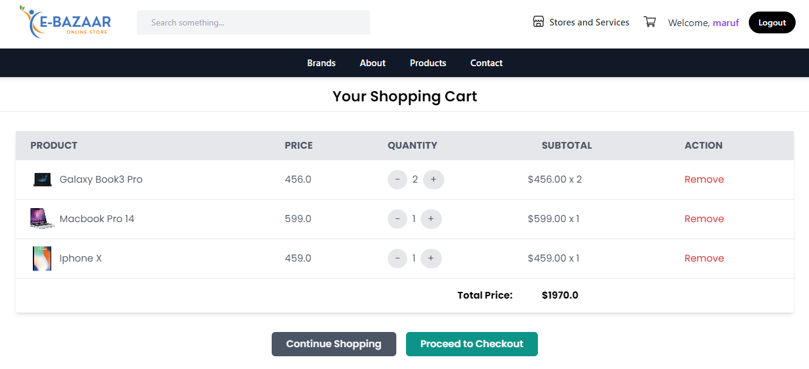

<h1>E-Bazaar -Authentic Product Selling Website</h1>

Welcome to E-Bazaar, your authentic destination for buying products hassle-free! With all the essential e-commerce features, E-Bazaar ensures a seamless shopping experience for users.

<h2>Features</h2>
<ul>
    <li>Product Explore: Browse through a wide range of products.</li>
    <li>Product Details: View detailed information about each product, including anti-counterfeit code, serial number, supplier, and supply chain details.</li>
    <li>Add to Cart: Easily add products to your cart for purchase.</li>
    <li>Cart Management: Update and delete items from your cart with real-time price updates.</li>
    <li>Checkout: Complete the checkout process to place your order.</li>
    <li>Order Confirmation Email: Receive an email confirmation after placing an order.</li>
    <li>Order Tracking: Track your orders from your profile.</li>
    <li>Stock Management: Automatic stock updates after purchase to ensure accurate availability.</li>
</ul>

<h2>Made With</h2>

     
     
    
     

<h2>Installation</h2>
<ol>
    <li>Clone the repository:</li>
</ol>

<pre><code>git clone https://github.com/yeakiniqra/E-Baazar.git</code></pre>

<ol start="2">
    <li>Navigate to the project directory:</li>
</ol>

<pre><code>cd e-bazaar</code></pre>

<ol start="3">
    <li>Install dependencies:</li>
</ol>

<pre><code>pip install -r requirements.txt</code></pre>
<pre><code>pip install Django</code></pre>

<ol start="4">
    <li>Apply migrations:</li>
</ol>

<pre><code>python manage.py migrate</code></pre>

<ol start="5">
    <li>Run the development server:</li>
</ol>

<pre><code>python manage.py runserver</code></pre>

<ol start="6">
    <li>Access the website at <code>http://localhost:8000</code> in your browser.</li>
</ol>

<h2>Screenshots</h2>

<h3>Homepage</h3>

<h3>Products</h3>

<h3>Product Details</h3>

<h3>Cart</h3>

<h3>Checkout</h3>

<h2>Developed by</h2>
<ul>
    <li><strong>Nazmul Yeakin Iqra</strong>, CSE, UAP</li>
    <li><strong>Naimul Islam</strong>, CSE, UAP</li>
    <li><strong>Maruf Ahammed</strong>, CSE, UAP</li>
</ul>

